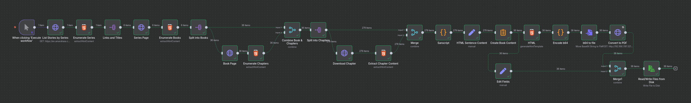

# Webscraped Amarahasa

This is not [Amarahasa](https://en.amarahasa.com/), but it is related.

I like using an e-reader and got annoyed that the website was not open source or available in other formats, so I made an [n8n](https://n8n.io) workflow to grab that data for me, format and organize it, create HTML templates with it, convert those HTML templates to PDF files, and save them in accordance with their series and book. 

I used the [Jaini Family](https://ektype.in/jaini-family.html) of devanagari fonts because they're my favorite, but you can obviously change that by modifying this workflow. 

I've included the PDFs I'm reading from as well as the tools I used to create them, all under the same license used by Amarahasa itself.

I hope this makes the content more accessible for other readers as well.

